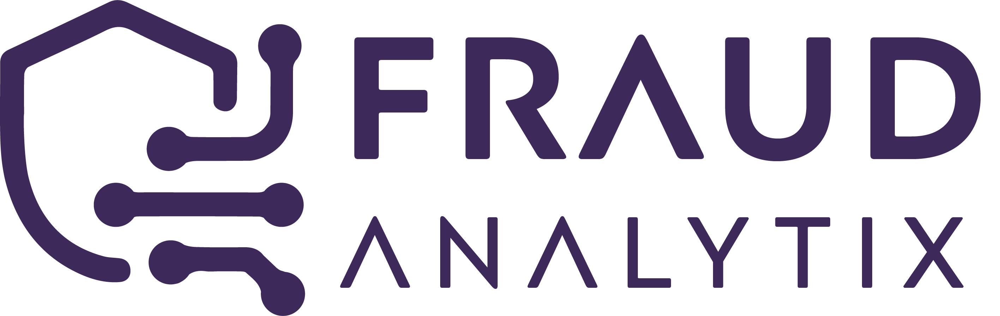

# BDM Project - Fraud Analytix
The project is to develop AI and machine learning data pipeline that leverage various data sources to offer Neobanks a third-party fraud detection and money laundering monitoring service.
- Install dependencies using requirements.txt 
- No need to execute pip for requirements.txt file inside airflow direcotry

## Data Sources
- Geolocation data
- Bank Transactions data
- Merchant Category Codes (Static Data)

## Apache Airflow (Workflow) Setup to orchestrate the flow.
 - The pipeline is setup under the `airflow > dags` directory.
 - `pipeline.py` lists all the dags and the pipeline sequence.
 - `operations.py` lists all the functionality of the pipeline including spark session.

## Data Generation
1. Run  `python main.py generate` to generate customers and transactions data
2. Generate command can also accept 3 argument i.e. number of customers, minimum and maximum transactions
3. Run  `python main.py generate --num_cust 1000 --min_trans 300 --max_trans 2400`

## Setting Up HDFS
1. Connect to virtual machine and place configurations from this repo to `$HADOOP_HOME/etc/hadoop/`
2. Goto `$HADOOP_HOME/sbin` direcotry and run `start-all.sh`

## Manual Execution of pipeline
1. Firs generate data and setup hadoop by following above instructions
2. Run `python main.py create_zones` to create landing directories
3. Run `python main.py upload` to upload data from staging area to temporal landing zone
4. Run `python main.py persist` to transform data and store it to persistent landing zone
5. Optionally run `python main.py purge` to purge data from temporal landing zone

## Using Airflow to Orchestrate Pipeline
1. Firs generate data and setup hadoop by following above instructions
2. Run `python main.py create_zones` to create landing directories
3. Goto airflow direcotry inside the project
4. To build the docker container run the command `docker build . --tag extend_airflow:latest`.
5. Run the docker using the command `docker compose up`.
6. Access the airflow WebUI on `http://localhost:8080/` and trigger DAG.

## Dag Tasks?
- Dag comprises 3 paths in the landing zone. 

### Staging Zone: `fs_conn_id='scan_file'`
1. `scan_new_file_task`: FileSensor to check new incoming files. Create connection on WEBUI Admin using `fs_conn_id='scan_file'`
2. `generate_transactions_geodata_task`: Create geodata from transaction file in JSON format 
3. `upload_to_staging_area_task`: Upload from client filesystem to FraudAnalytics staging zone on hdfs

### Temporary Zone
4. `rename_files_in_landing_folder_task`: Renames files with intial file name + client name + data received
5. `convert_to_parquet_and_save_task`: Convert using pyspark to dataframe, transform to hadoop parquet format and move it to persistent zone

### Persistent Zone
6. Created to store final parquet data for big data management.
7. `delete_old_files_task`: Delete files from Temporary zone older than 6 months.

## Dependencies?
```
scan_new_file_task >> generate_transactions_geodata_task >> upload_to_staging_area_task >> rename_files_in_landing_folder_task \
    >> move_files_to_temp_landing_folder_task >> convert_to_parquet_and_save_task
    
delete_old_files_task
```