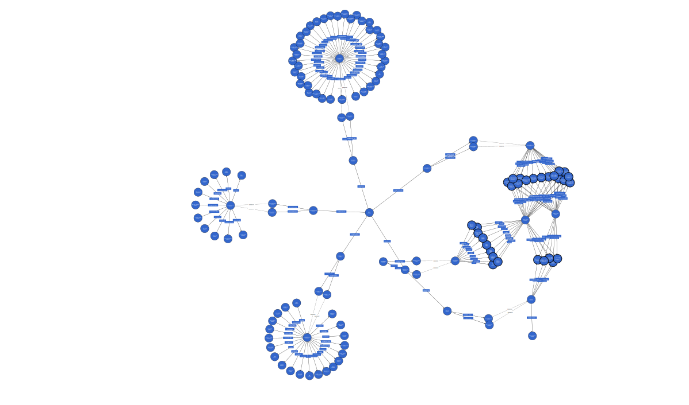

# SDM Project - Fraud Analytix
The purpose of implementing a data governance model in Fraud Analytix is to ensure compliance with government regulations and ethical practices while providing Explainability AI to our customers in the future. Additionally, the data governance model aims to effectively manage the metadata catalog, which serves as a dashboard for the organization.

Fraud Analytix relies on primary data sources such as transactions data and Geo location data, supplemented by static sources like merchant code data. As the business grows and evolves, the number and types of data sources are expected to change based on client requirements.

## Data Sources
- Geolocation data
- Bank Transactions data
- Merchant Category Codes (Static Data)

## Tools Used
 - WebVowl
 - GraphDB
 - RDFLib

## Graph 

## Complete ABOX

